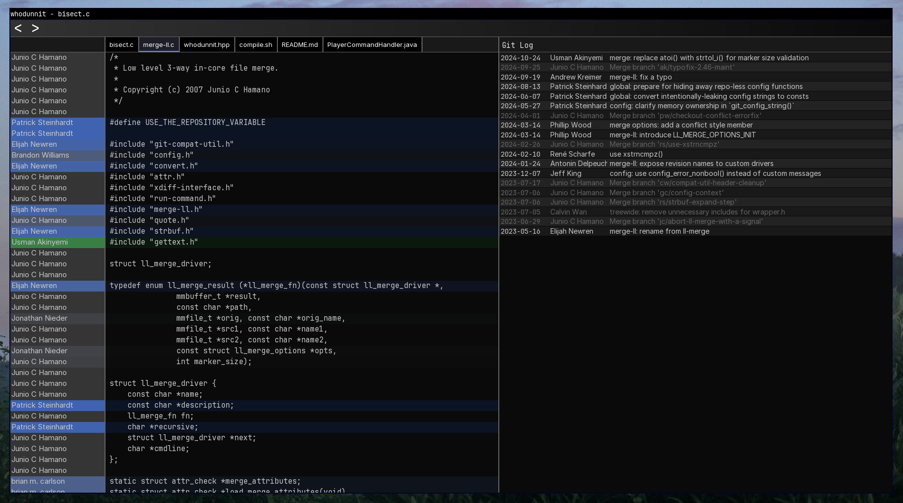

## This is a work-in-progress program!

Git blame viewer for Linux



## Compiling
```
sudo apt update
sudo apt install libxi-dev

sudo apt install \
    libxrandr-dev \
    libxcursor-dev \
    libudev-dev \
    libfreetype-dev \
    libflac-dev \
    libvorbis-dev \
    libgl1-mesa-dev \
    libegl1-mesa-dev \
    libfreetype-dev

cmake -B build
cmake --build build

./build/bin/main <file>
```

The included [JetBrains Mono](fonts/JetBrainsMono-Regular/JetBrainsMono-Regular.ttf) font is licensed under the OFL-1.1. A copy of this license is included in [fonts/JetBrainsMono-Regular/OFL.txt](fonts/JetBrainsMono-Regular/OFL.txt)\
The included [Inter](fonts/Inter/InterVariable.ttf) font is licensed under the OFL-1.1. A copy of this license is included in [fonts/Inter/LICENSE.txt](fonts/Inter/LICENSE.txt)
